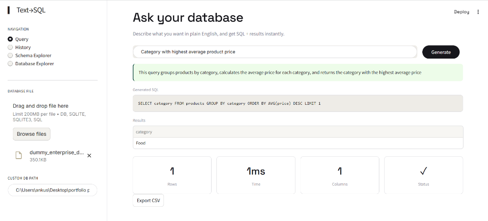
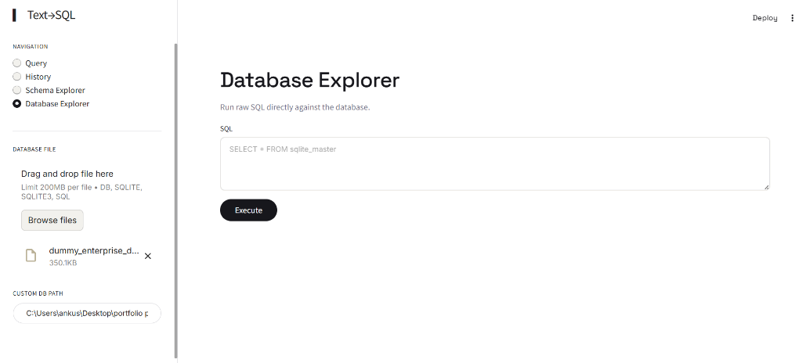
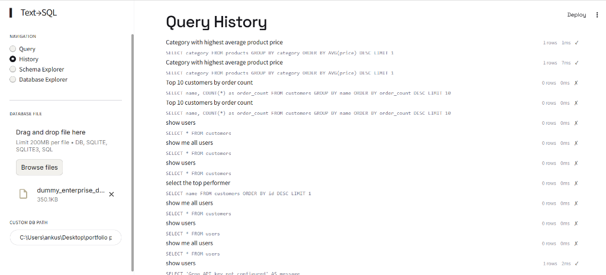

# Text-to-SQL Enterprise

[](https://text-to-sql-enterprise-rag-u44ae2is6ppvwu77kxn5qh.streamlit.app)

Natural language to SQL analytics platform with safe execution, schema understanding, and a Streamlit UI.


## Previews

### 1. Ask Your Database (Natural Language Queries)


### 2. Database Explorer (Raw SQL Editor)


### 3. Query History & Performance Metrics


## Quick Start

```bash
cp .env.example .env
pip install -r requirements.txt

# Start API
uvicorn app.main:app --reload

# In another terminal, start UI
streamlit run frontend/streamlit_app.py
```

Set `GROQ_API_KEY` and `GEMINI_API_KEY` in `.env` for full functionality. Without them, the app runs with placeholder responses.

## Architecture

```
├── app/                  # FastAPI backend
│   ├── main.py          # App entry, middleware, lifespan
│   ├── config.py        # Settings from env
│   ├── database.py      # SQLAlchemy engine + session
│   ├── models.py        # ORM models
│   ├── router.py        # API endpoints
│   ├── llm.py           # Groq + Gemini clients
│   └── chroma_store.py  # Schema indexing + retrieval
├── core/
│   └── sql_executor.py  # Safe read-only SQL execution
├── frontend/
│   └── streamlit_app.py # UI (Cohere-inspired design)
├── tests/
│   ├── test_sql.py      # SQL validation + execution tests
│   └── test_api.py      # API endpoint tests
```

## API

| Method | Path | Description |
|--------|------|-------------|
| POST | `/api/query` | NL → SQL → execute |
| POST | `/api/explain` | Explain a SQL query |
| POST | `/api/optimize` | Suggest SQL optimizations |
| POST | `/api/schema/index` | Index DB schema |
| GET | `/api/schema/search` | Search schemas by relevance |
| GET | `/api/history` | Query history |
| GET | `/health` | Health check |

## Testing

```bash
pytest tests/ -v
```

## Indexing Your Schema

POST to `/api/schema/index` with your table definitions:

```json
{
  "tables": [
    {
      "name": "orders",
      "description": "Customer order records",
      "columns": [
        {"name": "id", "type": "INTEGER", "pk": true},
        {"name": "customer_id", "type": "INTEGER", "fk": "customers.id"},
        {"name": "total", "type": "DECIMAL(10,2)"}
      ]
    }
  ]
}
```
